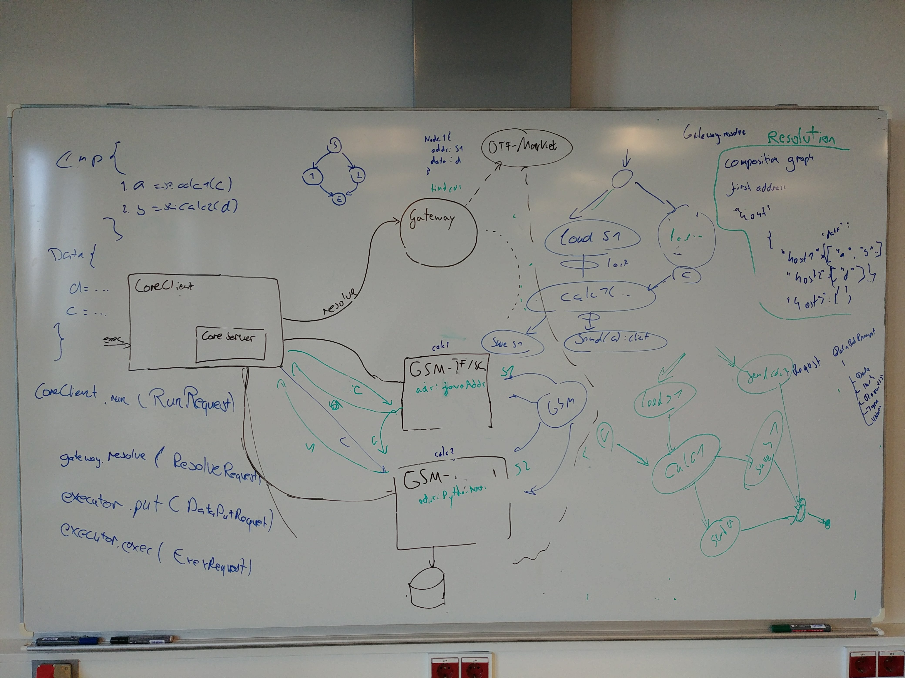

## Components inside SEDE

* Core Client (Receive the request, lets the gateway create a roadmap and sends an exection-graph and user data to slaves as defined by the gateway.)
  * `run(RunRequest):Result`
* Gateway (Resolves requests by translating a composition to a graph which coordinates executioners to carry out the request.)
  * `resolve(ResolveRequest):ExecutionGraph`
  * `register(ExecutorRegistration)`
  * `loadServices(Service)`
* Executor (Slave which receives graphs from Core Client and completes it. Besides it accepts user data.)
  * `exec(ExecRequest)`
  * `putData(PutDataRequest / PutDataPrompt)` 
  * `loadServices(Service)`
* OTF Market (Knows every Gateway and their capabilties (Services they provide).)
  * `register(GatewayRegistration)`

## External Actors

* OTF Provider (Sends request to Core Client. Asks OTF Market for information about available service).
* Service Provider (Deploys Services (Libraries) to Gateway).

## HttpRequest information flow table

x indicates that the Request contains the information.

Request | RequestID | Composition(FM) | Composition(Graph) | Policy | DataObjects
-|-|-|-|-|-
Run | x | x | | x | x 
Resolve | x | x | | x 
PutData | x | | | | x 
Exec | x | | x |  |

