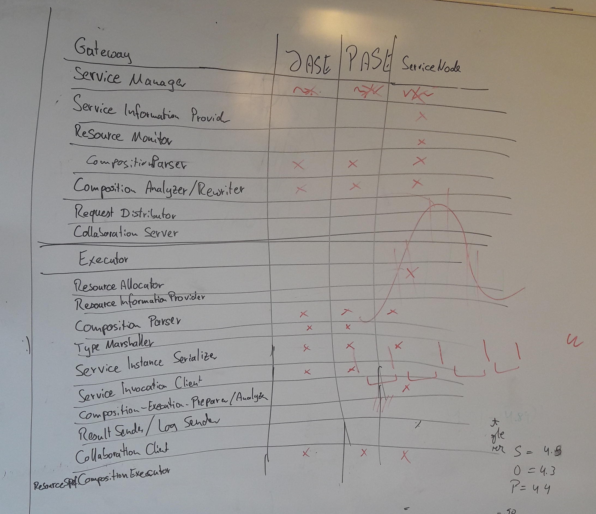

## Gateway

Interfaces | JASE | PASE | ServiceNode | SEDE
------------ | ------------- | ------------- | ------------ | ------------
Service Manager | ~ | ~ | ~
Service Information Provider | | | x
Resource Monitor | | | x
Composition Parser/Analyzer/Rewriter | x | x | x
Request Distribution / Load Balancing | | | 
Collaboration Server | | | 

## Executioner

Interfaces | JASE | PASE | ServiceNode | SEDE
------------ | ------------- | ------------- | ------------ | ------------
Resource Allocator | | | x
Resource Information Provider | | |
Composition Parser | x | x | x
Semantic Type Marshaller | x | x |
Service Instance Serializer | x | x | x
Service Invocation Client | x | x |
Composition Execution-Preprarer/Analyzer | | | x
Result Sender / Log Sender | | |
Collaboration Client | | |
Composition Executor | x | x | x

## GSM Client

?

